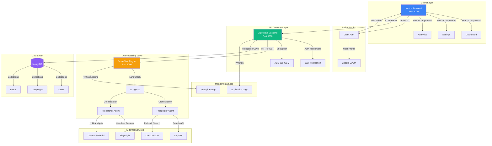
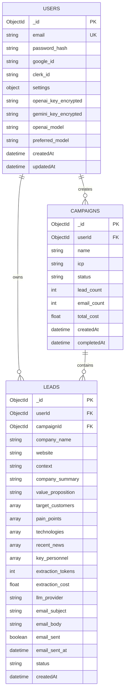
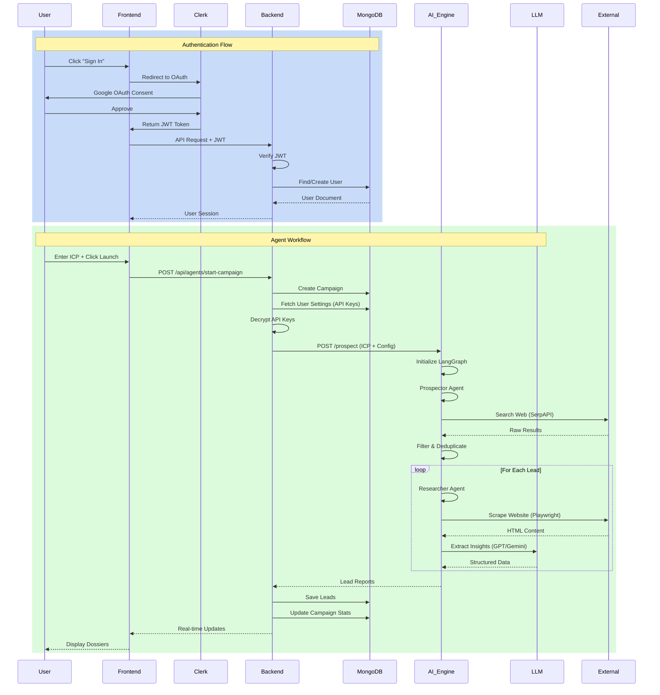
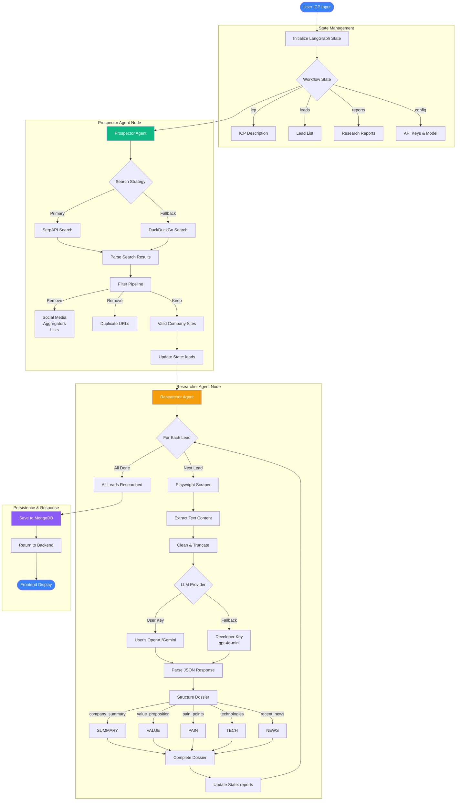

# 🚀 The Revenue Engine: AI-Powered Lead Generation Platform

**The Revenue Engine** is an intelligent lead generation and research platform powered by autonomous AI agents. Automatically discover, research, and qualify potential customers with deep company insights.


---

## 🚀 Overview

Unlike traditional tools that just give you a static list of emails, this system employs **Autonomous AI Agents** to:

1. **Find** companies matching your Ideal Customer Profile (ICP) using real-time search
2. **Visit** their actual websites (using headless browsers) to "read" their value proposition
3. **Generate** a "Deep-Dive Dossier" with key insights, technologies used, and context for outreach
4. **Save** all data to a persistent database for your CRM pipeline

---

## ✨ Key Features

### 🎯 **AI-Powered Prospecting**
- Intelligent web search for companies matching your ICP
- Multi-source data aggregation (SerpAPI, DuckDuckGo)
- Smart filtering and deduplication
- Blacklist filtering for aggregators

### 🔍 **Deep Company Research**
- Automated company analysis using GPT-4 / Gemini
- Extracts:
  - Company summary & value proposition
  - Target customers & pain points
  - Technologies used
  - Recent news & developments
  - Key personnel

### 📊 **Analytics Dashboard**
- Campaign performance tracking
- Cost analysis (API usage)
- Lead quality metrics
- Historical trends with Recharts

### ⚙️ **Advanced Settings**
- **Multi-Model Support**: Choose between OpenAI (GPT-4, GPT-4-turbo, GPT-4o-mini) or Google Gemini
- **API Key Management**: Bring your own keys or use developer fallback
- **Smart Fallback**: Automatically switches to developer key if user key fails
- **Cost Protection**: Enforces cheap models when using developer quota

### 📧 **Email Generation**
- AI-generated personalized outreach emails
- Template management
- Context-aware messaging based on research

### 📜 **Campaign History**
- Track all your searches
- Revisit past campaigns
- Export lead data

---

## 🏗️ Architecture

The system follows a **Hybrid Microservices** architecture to ensure scalability and separation of concerns:

```
┌─────────────────┐      ┌─────────────────┐      ┌─────────────────┐
│   Next.js       │─────▶│   Express.js    │─────▶│   FastAPI       │
│   Frontend      │      │   Backend       │      │   AI Engine     │
│   (Port 3000)   │      │   (Port 5000)   │      │   (Port 8000)   │
└─────────────────┘      └─────────────────┘      └─────────────────┘
                                 │
                                 ▼
                         ┌─────────────────┐
                         │   MongoDB       │
                         │   Database      │
                         └─────────────────┘
```

---

## 📊 System Diagrams

### 1️⃣ Full Application Architecture



### 2️⃣ Database Schema



### 3️⃣ Authentication & Agent Flow



### 4️⃣ Complete Agent Architecture (LangGraph)



---

## 🛠️ Tech Stack

**Frontend**:
- Next.js 14 (App Router)
- React 19
- TailwindCSS + Shadcn UI
- Recharts (Analytics)
- Clerk (Authentication)

**Backend**:
- Node.js + Express
- MongoDB + Mongoose
- JWT Authentication
- AES-256-GCM Encryption
- Winston Logger

**AI Engine**:
- Python 3.11 + FastAPI
- LangChain + LangGraph
- OpenAI GPT-4 / Google Gemini
- Playwright (Web Scraping)
- SerpAPI + DuckDuckGo (Search)

---

## 🚀 Quick Start

### **Prerequisites**
- Docker & Docker Compose (recommended)
- Node.js 18+ (for local development)
- Python 3.11+ (for local development)
- MongoDB

### **Option 1: Docker (Recommended)**

```bash
# 1. Clone the repository
git clone https://github.com/AJBIKI/Lead-prime-16012026.git
cd Lead-prime-16012026

# 2. Set up environment variables
cp server/.env.example server/.env
cp ai_engine/.env.example ai_engine/.env
# Edit both .env files with your credentials

# 3. Start all services
docker-compose up -d

# 4. Access the application
# Frontend: http://localhost:3000
# Backend: http://localhost:5000
# AI Engine: http://localhost:8000
```

### **Option 2: Manual Setup**

#### **1. Setup AI Engine**
```bash
cd ai_engine
python -m venv venv
source venv/bin/activate  # On Windows: venv\Scripts\activate
pip install -r requirements.txt
playwright install chromium
python main.py  # Runs on localhost:8000
```

#### **2. Setup Backend**
```bash
cd server
npm install
node index.js  # Runs on localhost:5000
```

#### **3. Setup Frontend**
```bash
cd client
npm install
npm run dev  # Runs on localhost:3000
```

---

## 🎯 Usage

1. Open your browser to `http://localhost:3000`
2. Sign in with Google OAuth
3. In the **Campaign Configuration** input, describe your target:
   - *Example*: "Series A Fintech startups in London"
   - *Example*: "AI companies building autonomous agents in San Francisco"
4. Click **Launch Discovery Engine**
5. Watch as the AI Agents populate the dashboard with live data

---

## 📖 Documentation

- **[DEPLOYMENT.md](./DEPLOYMENT.md)** - Deploy to Railway or Render
- **[SECURITY.md](./SECURITY.md)** - Environment variables & security best practices
- **[PHASE4_PLAN.md](./PHASE4_PLAN.md)** - Development roadmap
- **[PHASE4_7_PLAN.md](./PHASE4_7_PLAN.md)** - Advanced model selection feature

---

## 🔐 Security

- ✅ **AES-256-GCM Encryption** for user API keys
- ✅ **JWT Authentication** with secure cookies
- ✅ **Environment variables** for sensitive data (never committed)
- ✅ **Rate limiting** on API endpoints
- ✅ **Input validation** and sanitization
- ✅ **HTTPS** enforced in production

See [`SECURITY.md`](./SECURITY.md) for detailed security documentation.

---

## 💰 Cost Optimization

### **API Usage**
- **OpenAI GPT-4o-mini**: ~$0.15/1M input tokens, $0.60/1M output tokens
- **Google Gemini Flash**: ~$0.075/1M tokens
- **SerpAPI**: $50/month for 5,000 searches

### **Typical Costs**
- **Per Lead Research**: $0.0002 - $0.0005 (with GPT-4o-mini)
- **Per Campaign** (5 leads): ~$0.001 - $0.003

### **Cost Protection**
- User API keys for premium models
- Developer key locked to `gpt-4o-mini`
- Automatic fallback with cost enforcement

---

## 🔮 Roadmap

### ✅ **Completed**
- [x] AI-powered prospecting with Prospector Agent
- [x] Deep company research with Researcher Agent
- [x] Analytics dashboard with Recharts
- [x] Settings & API key management
- [x] Campaign history tracking
- [x] Multi-model support (OpenAI/Gemini)
- [x] Smart fallback system with cost protection
- [x] Email generation
- [x] Docker deployment setup

### 🚧 **In Progress**
- [ ] Email automation & scheduling
- [ ] Template management UI
- [ ] Follow-up sequences

### 📋 **Planned**
- [ ] Recursive crawling (About Us, Team pages)
- [ ] LinkedIn integration
- [ ] CRM integrations (Salesforce, HubSpot)
- [ ] Advanced filtering & scoring
- [ ] Team collaboration features
- [ ] Public API access

---

## 🤝 Contributing

Contributions are welcome! Please:
1. Fork the repository
2. Create a feature branch
3. Make your changes
4. Submit a pull request

---

## 📝 License

This project is licensed under the MIT License.

---

## 🙏 Acknowledgments

- OpenAI for GPT-4 API
- Google for Gemini API
- LangChain for agent framework
- Railway/Render for hosting

---

## 📧 Support

For issues and questions:
- **GitHub Issues**: [Create an issue](https://github.com/AJBIKI/Lead-prime-16012026/issues)
- **Email**: torretobraga003@gmail.com

---

## 🌟 Star History

If you find this project useful, please consider giving it a star! ⭐

---

**Built with ❤️ by Aritra**
